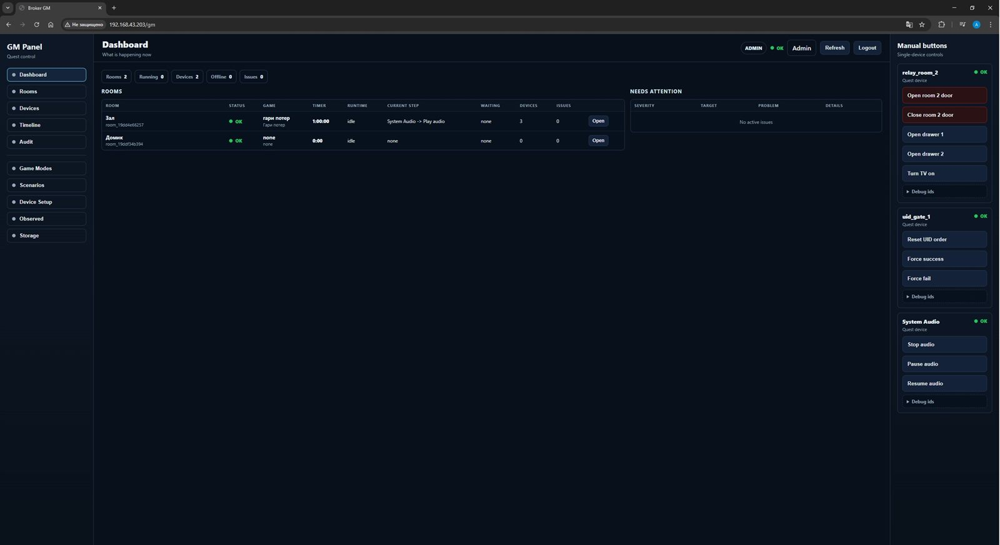

# SceneHub

SceneHub is an ESP32-S3 based local orchestration hub for quest rooms,
interactive exhibits and show-control installations.

Earlier internal docs and UI labels used the name "Quest Orchestrator" for the
firmware/game-control layer. The project name is now SceneHub; legacy wording
should be treated as historical naming unless a device protocol field still
uses `quest` terminology.

The firmware includes:

- local MQTT broker module
- Web UI with authentication
- Quest Device capability model
- schema-driven Room Scenario runtime
- Game Mode/profile selection
- GM room/session control model
- local Hardware IO system devices for relay and MOSFET outputs
- audio playback and background/effect mixing
- OTA firmware update

Recent operational changes worth knowing:

- Admin bootstrap login is `admin / admin` only until the first forced password
  change completes.
- Manual HTTP device-command responses are now dispatch envelopes:
  async remote work returns `accepted` plus `request_id`, not fake terminal
  `done`.
- State-changing hub endpoints are being converged to `POST` plus request body
  under [docs/API_HTTP_POLICY.md](docs/API_HTTP_POLICY.md).

The firmware is designed for stand-alone escape room and interactive exhibit setups where the controller acts as both the game control plane and the local integration point for field devices. MQTT broker functionality is one module inside the product, not the product identity.

## Deployment / Field Use

A reduced SceneHub core has been running for about six months in a real cafe /
family venue with children as the primary guests. That deployed build is not the
full current repository feature set; it is a simplified production branch of the
same local-orchestration idea.

The field system is used as the local control point for interactive room
behavior: operator control, timed scenario flow, device-triggered events,
audio/light/relay-style effects and safe local hardware control. The current
repository is the expanded firmware line that folds those lessons into a more
general room/scenario/device architecture.

## Main Capabilities

- Embedded MQTT broker for local devices over Wi-Fi
- Web UI for status, settings, audio, firmware update and GM entry
- Role-aware GM panel for operator workflow and admin setup
- Quest Devices capability model with imported or manually entered commands/events
- Built-in System Devices such as `system_audio`, `system_relay` and `system_mosfet`, exposed through the same command/event model
- Schema-driven Room Scenario runtime with validation, normal flow branches, Reactive Branch v2 reactions, device commands, device-event waits, wait-time and operator gates
- Game Modes that select room scenario, duration and future content packs
- Room-level and device-level action facades with in-memory audit trail
- Device control contract ingest (`heartbeat/status/diag/result`)
- Observed control device visibility with quest-device binding
- Admin `MQTT Interface` setup with on-demand `describe_interface` discovery
- OTA update flow with rollback-aware status
- Local status LED and fault monitoring
- Registered offline quest devices treated as critical room/system faults
- System audio can be used from room scenarios through `DEVICE_COMMAND system_audio play/stop/pause/resume/set_volume`; audio has separate background/effect channels with one I2S mixer owner.

## Current Architecture

The current codebase is split by ownership boundary rather than by UI page.
The important components are:

- `audio_player` - local playback, background/effect mixer and I2S output
- `command_executor` - dispatch boundary for MQTT, local hardware and system commands
- `config_store` - mutable runtime/NVS configuration
- `device_control_ingest` - parses physical-client heartbeat/status/diag/result/event telemetry
- `error_monitor` - service and device fault aggregation
- `event_bus` - internal typed event transport
- `gm_core` - room session runtime, timers, waits, flags, reactive state and command plans
- `gm_profile_store` - Game Mode profile storage, validation and JSON import/export
- `gm_sidebar_store` - GM quick-action preset storage
- `hardware_io` - local relay/MOSFET/universal IO control and safe-off
- `mqtt_core` - embedded local MQTT broker
- `network` - Wi-Fi, setup AP and network lifecycle
- `orchestrator_core` - audit, timeline and health aggregation support
- `ota_manager` - OTA lifecycle and rollback confirmation
- `quest_common` - shared current-model limits and safe string helpers
- `quest_device` - Quest Device capability store for physical clients and system devices
- `room_catalog` - file-backed room list
- `room_scenario` - scenario model, validation, JSON import/export and runtime semantics
- `scenehub_config` - compile-time Kconfig defaults shared by firmware components
- `scenehub_control` - write-side application facade for GM/scenario/profile/device actions
- `scenehub_device_command_resolver` - compact device-command resolution helper
- `scenehub_events` - shared event definitions/adapters
- `scenehub_read_model` - read-side projections for APIs and UI
- `scenehub_scenario_validation` - product-aware scenario environment validation
- `scenehub_state` - cross-component state invalidation/versioning
- `sd_storage` - SD card ownership
- `service_status` - service health state
- `status_led` - device status indication
- `system_reset_policy` - boot setup-AP request and runtime reset/defaults policy
- `web_ui` - HTTP API, auth, GM panel assets and UI endpoints
- `ws_runtime` - WebSocket runtime refresh transport

Detailed architecture notes are in:

- `docs/ARCHITECTURE.md`
- `docs/COMMAND_RESULT_SEMANTICS.md`
- `docs/API_HTTP_POLICY.md`
- `docs/QUEST_DEVICE_SETUP_RUS.md`
- `docs/ROOM_SCENARIO_SETUP_RUS.md`

## Startup Policy

The firmware uses three practical boot classes:

- `BOOT_FATAL` - platform infrastructure that must succeed before normal boot continues
- `BOOT_DEFERRED_FATAL` - product services that may start in a later bootstrap stage but are still mandatory for a usable device
- `BOOT_OPTIONAL` - services that may fail without blocking the rest of the product

Current implementation shape:

- platform-critical startup is synchronous in `main/main.c`: NVS, OTA boot
  notification, `config_store`, reset/setup policy, `service_status`,
  `event_bus`, `device_control_ingest`, `error_monitor`, `scenehub_control`
  and `scenehub_state`;
- product stores are initialized and loaded before the Web UI comes up:
  Quest Devices, rooms, room scenarios and Game Mode profiles;
- network, MQTT and Web UI startup run in the deferred bootstrap task and are
  still treated as fatal for a usable hub;
- `audio_player` and `hardware_io` are optional services. Failures are exposed
  as faults, but the hub can still boot far enough for diagnostics and setup.

This is a working startup scheme, but not yet a fully unified startup
orchestrator.

## Requirements

- ESP32-S3
- PSRAM enabled
- SD card connected to configured SPI pins
- I2S audio output connected if audio playback is used
- ESP-IDF 5.3.x

## Build

```bash
idf.py set-target esp32s3
idf.py menuconfig
idf.py build
idf.py -p COMx flash monitor
```

## Tests

The project has automated tests at multiple levels:

- `tests/quest_backend` - backend/domain tests for rooms, devices, scenarios, GM sessions, orchestration and Web UI contracts
- `tests/mqtt_core` - local broker unit/regression tests
- `tests/stress_chaos_tests` - external protocol/stress scripts against a running SceneHub device

Key documented coverage includes:

- Quest Device validation/import/export
- Room Scenario validation/runtime/storage
- Game Mode validation/storage
- GM room session game start/stop/reset
- MQTT broker semantics:
  - retained messages
  - wildcard routing
  - max subscriptions
  - soak/stability checks

Detailed test notes and run commands are in:

- `docs/TESTING.md`

## Important Runtime Storage

### NVS

Stored in `config_store`:

- Wi-Fi config
- MQTT config and credentials
- Web credentials
- time/NTP config
- logging flags

### SD Card

Stored through `sd_storage` and used by higher-level services:

- room catalog in `/sdcard/quest/rooms.json`
- quest devices in `/sdcard/quest/quest_devices.json`
- room scenarios in `/sdcard/quest/room_scenarios.json`
- game profiles in `/sdcard/quest/game_profiles.json`
- audio files

## Web UI

The Web UI is served directly by the firmware.

Main functional areas:

- Status
- GM (operator/admin quest panel)
- Audio
- Settings
- Update

The `/gm` panel is the primary quest console:

- operators can select profiles, start/stop/reset games, watch timers, scenario progress, waits, issues, devices, audit and timeline
- admins get additional sections for Profiles, Scenarios, Device Setup and Storage
- admins can test local relay/MOSFET/input/GPIO channels from Hardware IO
- device setup and scenario/profile editing are admin-only
- the main admin web surface should stay a lightweight system entry point and utility area

### Screenshots

#### Dashboard



#### Room Control


#### Device Setup


#### Scenario Setup


#### Reactive Branches


#### Timeline


Authentication:

- cookie-based session auth
- admin account with bootstrap `admin / admin` and forced first password change
- operator/user account with GM-first routing
- credential reset supported by hardware reset flow
- setup AP password is configurable with `CONFIG_SCENEHUB_SETUP_AP_PASSWORD`

GM/orchestrator API highlights:

- `GET /api/gm/state` returns GM dashboard and room state
- `GET /api/gm/room/profiles` lists selectable profiles for a room
- `POST /api/gm/room/profile/select` selects a profile for a room session
- `POST /api/gm/room/game/start` starts timer and room scenario from the selected profile
- `POST /api/gm/room/game/stop` stops the current game
- `POST /api/gm/room/game/reset` resets the current game/session
- `GET /api/orchestrator/control/devices` returns observed control-contract devices
- `POST /api/gm/device/describe-interface` requests a physical client quest interface
- `GET /api/orchestrator/audit/recent` returns recent action audit entries
- `GET /api/hardware-io/status` returns local relay/MOSFET/input/GPIO channel status and service availability/fault metadata

## OTA Update

OTA is supported through the Web UI.

Flow:

1. open the firmware update page
2. upload the built firmware binary
3. device writes image into OTA partition
4. device reports `phase=reboot_required`
5. operator explicitly requests reboot
6. device boots into new image
7. healthy boot confirms the update

The OTA status view shows:

- running partition
- boot partition
- current app version
- transfer progress
- lifecycle phase
- rollback-related state

Main OTA phases exposed by the API:

- `idle`
- `uploading`
- `reboot_required`
- `rebooting`
- `verify_wait_ready`
- `verify_pending`

## Quest Runtime Model

The current product model is intentionally simple:

- Quest Devices describe capabilities: commands, events, physical client id and operator-visible name.
- Devices do not own quest flow and do not require room assignment.
- Physical clients report health through `cp/v1/dev/{client_id}/{heartbeat|status|diag|result}`.
- Admin Device Setup can import capabilities through on-demand `describe_interface` or enter commands/events manually.
- Room Scenarios are the only place where quest flow is assembled.
- Game Modes select a room scenario and duration/settings.
- Built-in orchestrator services, starting with audio, are exposed as System Devices.
- Local relay and MOSFET outputs are also exposed as System Devices, so scenarios
  can use the same `DEVICE_COMMAND` path for built-in hardware and external
  Quest Devices.
- Gameplay runs through Quest Devices, Room Scenarios, Game Modes and GM Sessions.

`MQTT Interface` is now a capability-import workflow for locally smart/custom devices such as an altar, UID gate, relay controller or timer module. The admin selects an observed client, presses `Get config`, and SceneHub sends `describe_interface`. Returned commands become device command capabilities/manual buttons; returned events become presets for room scenario waits.

## Room Scenarios

Room scenarios are executed by the GM room session runtime.

Supported room step types include:

- `DEVICE_COMMAND`
- `DEVICE_COMMAND_GROUP`
- `WAIT_DEVICE_EVENT`
- `WAIT_ANY_DEVICE_EVENT`
- `WAIT_ALL_DEVICE_EVENTS`
- `WAIT_TIME`
- `OPERATOR_APPROVAL`
- `SHOW_OPERATOR_MESSAGE`
- `SET_FLAG`
- `WAIT_FLAGS`
- `END_GAME`

Room scenarios support validation before start, a running-scenario snapshot on start, JSON import/export, and filesystem save/load. This avoids starting broken quest flows and prevents config edits from changing a scenario already in progress.

`END_GAME` finishes the timer/session but does not automatically stop audio or
turn off local hardware outputs. Use explicit `system_audio.stop`,
`system_relay.set/off` or `system_mosfet.all_off` steps when a scenario finale
needs those side effects. `Stop game` and `Reset game` perform hardware safe-off
for built-in relay/MOSFET/GPIO outputs.

Room scenario branches have two product roles:

- `normal` branches are the quest flow. They can be required for completion and
  can synchronize with each other through flags.
- `reactive` branches are Reactive Branch v2 reactions. A reaction listens for
  a trigger event, checks optional guard flags, selects an action variant by
  policy (`single`, `rotate`, `random`, or `escalate`), runs sequential actions,
  then returns to listening or cooldown. Reactions are shown separately from
  the main flow and do not count toward game completion. They share the same
  runtime flags as normal branches, so a reaction can `SET_FLAG` and a normal
  branch can continue from `WAIT_FLAGS`.

Reactive Branch v2 actions currently support device commands, command groups,
wait-time, device-event waits, wait-any/wait-all, wait-flags, set-flag,
operator messages, explicit fail and explicit reset. Result-required commands
go through the command executor: `accepted` keeps the action pending, `done`
advances it, and `failed`/`rejected`/`timeout` follow the reaction result
policy.

For `Same actions` reactions, `Can repeat` keeps `max_fire_count=0`; `Run once`
sets `max_fire_count=1`.

## Hardware IO

`hardware_io` provides the first local output layer:

- `system_relay`: 4 configurable relay channels with `set`, `pulse` and manual-only `toggle`
- `system_mosfet`: 4 PWM channels with `set`, `fade`, `pulse` and `all_off`

Pins, relay active-low mode, PWM frequency and max pulse/fade durations are
configured through `CONFIG_SCENEHUB_*` settings in menuconfig. Disabled channels
use GPIO `-1`.

Startup initializes outputs in the safe/off state. `Stop game` and `Reset game`
also force built-in relay/MOSFET/GPIO outputs off. `END_GAME` intentionally does not,
matching the audio policy: finale cleanup must be explicit scenario behavior.

### Game Profiles

A game profile is a playable mode for a room.

It stores:

- profile id/name
- room id
- room scenario id
- game duration
- future hint/audio pack ids
- enabled flag

Starting a game by profile applies the duration, selects the scenario and starts the room scenario runtime.

## Audio

Audio is handled by `audio_player`.

Responsibilities:

- playback control
- runtime command routing
- background WAV playback
- effect WAV/MP3 playback
- background/effect PCM mixing through one I2S writer
- `system_audio.stop` without a channel stops both background and effect
- stop/reset silence drain so the I2S DAC does not hold the last audio sample
- reader and decode pipeline
- I2S output
- playback status
- volume persistence

Internal split:

- `audio_player.c` - public facade
- `audio_player_runtime.c` - runtime owner, command queue and playback lifecycle
- `audio_player_decode.c` - reader worker and decode path
- `audio_player_mixer.c` - background/effect PCM mixer and single I2S writer
- `audio_player_output.c` - I2S output
- `audio_player_status.c` - playback status
- `audio_player_volume.c` - volume persistence

The SD card is not owned by audio anymore. Audio uses `sd_storage` like any other consumer.

## MQTT

`mqtt_core` implements the local MQTT broker module.

Responsibilities:

- client sessions
- publish path
- injected local MQTT messages
- event mapping to internal bus
- stats for UI/status

The MQTT broker module is intended for local embedded devices and puzzle hardware, not as a general-purpose internet-facing broker.

Current MQTT broker sizing targets:

- max subscriptions per client: `16`
- max MQTT payload: `4096` bytes
- max MQTT packet: `6144` bytes

The larger packet budget is needed for on-demand `describe_interface` responses from universal quest devices.

Control-contract devices publish:

- `cp/v1/dev/{client_id}/heartbeat`
- `cp/v1/dev/{client_id}/status`
- `cp/v1/dev/{client_id}/diag`
- `cp/v1/dev/{client_id}/result`

SceneHub sends control commands to:

- `cp/v1/dev/{client_id}/control/command`

## Event Bus

`event_bus` is the internal transport between modules.

Current design:

- typed events for MQTT, flags, runtime, device status and control
- priority posting for urgent device/control events
- fixed message pool with PSRAM-first allocation
- FreeRTOS queue stores message pointers, not full payload structs
- separate job queue for heavier handler work
- drop counters and slow-handler counters exposed through `/api/status`

GM room scenario event matching uses its own value-copy queue of
`scenehub_event_t`, so scenario event handling does not allocate/free heap
memory on every device event.

Handlers should stay short and act as adapters only. Work that can block,
publish MQTT, scan runtime state, build snapshots, parse large payloads or
trigger scenario logic should be deferred with `event_bus_post_job()` or moved
into the receiving component task/queue.

## Status and Fault Monitoring

`error_monitor` drives the status LED and aggregates health signals.

Examples:

- Wi-Fi disconnected
- SD missing or mount failure
- audio fault indication

SD card state now reaches `error_monitor` through `event_bus`, not through direct calls from storage.

GM/orchestrator health uses both configured logical devices and observed control-contract clients:

- fresh telemetry means `online`
- a registered quest device with stale/missing telemetry is `offline`
- offline registered devices create `device_offline` errors and make the room/system `fault`
- configured devices that have not been observed yet are degraded/warning during setup
- UI status badges must prefer `offline`/`unknown` over stale `health=ok`

The default online timeout for observed control clients is currently 15 seconds.

## Tools

`tools/device_control_client` provides a Python simulator for control-contract devices.

It can run multiple sample clients, publish heartbeat/status/diag/result, answer `describe_interface`, subscribe to quest command topics and emit quest events. It is useful for testing GM Device Setup, manual buttons, observed registration and offline handling before real devices are available.

## Project Layout

```text
components/
  audio_player/
  command_executor/
  config_store/
  device_control_ingest/
  error_monitor/
  event_bus/
  gm_core/
  gm_profile_store/
  gm_sidebar_store/
  hardware_io/
  mqtt_core/
  network/
  orchestrator_core/
  ota_manager/
  quest_common/
  quest_device/
  room_catalog/
  room_scenario/
  scenehub_config/
  scenehub_control/
  scenehub_device_command_resolver/
  scenehub_events/
  scenehub_read_model/
  scenehub_scenario_validation/
  scenehub_state/
  sd_storage/
  service_status/
  status_led/
  system_reset_policy/
  web_ui/
  ws_runtime/
docs/
  ARCHITECTURE.md
main/
  main.c
```

## Documentation

- `docs/README.md` - index of current firmware and desktop documentation
- `docs/ARCHITECTURE.md` - module boundaries and layered design
- `docs/COMMAND_RESULT_SEMANTICS.md` - command lifecycle and dispatch-envelope semantics
- `docs/API_HTTP_POLICY.md` - HTTP method/payload hygiene policy
- `docs/device_control_contract_v1.md` - MQTT control contract and interface discovery
- `docs/KNOWN_ISSUES.md` - active backlog for open product/runtime/architecture work
- `docs/QUEST_DEVICE_SETUP_RUS.md` - Quest Device setup guide
- `docs/ROOM_SCENARIO_SETUP_RUS.md` - Room Scenario and Game Mode setup guide

## License

SceneHub is source-available proprietary software. The code is visible for review and collaboration, but use, copying, modification, redistribution, deployment, production installation, commercial use, or derivative products require prior written permission from the copyright holder.

See `LICENSE` for details. Third-party components remain under their own license terms.

## Notes for Further Work

Likely next evolutions:

- unified startup orchestrator instead of procedural deferred bootstrap
- fixed-pool job contexts for heavy event bus jobs
- further cleanup of `audio_player` if playback complexity grows
- more OTA diagnostics
- more tests around config/profile/runtime transitions
- optional persistent audit storage (current audit is RAM-only ring buffer)
