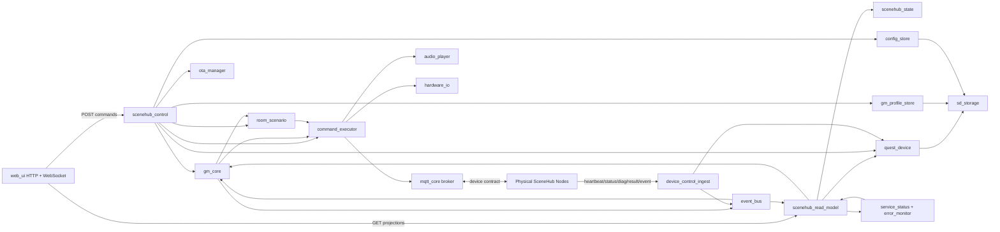
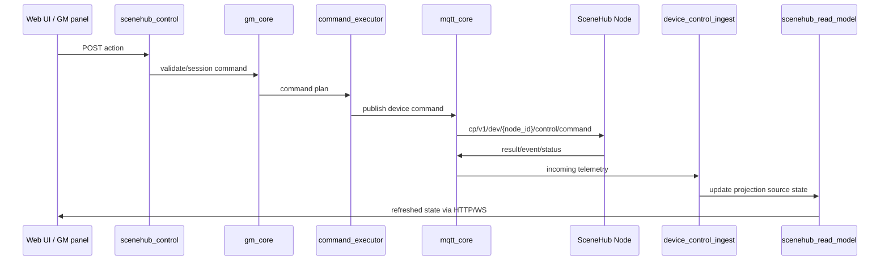
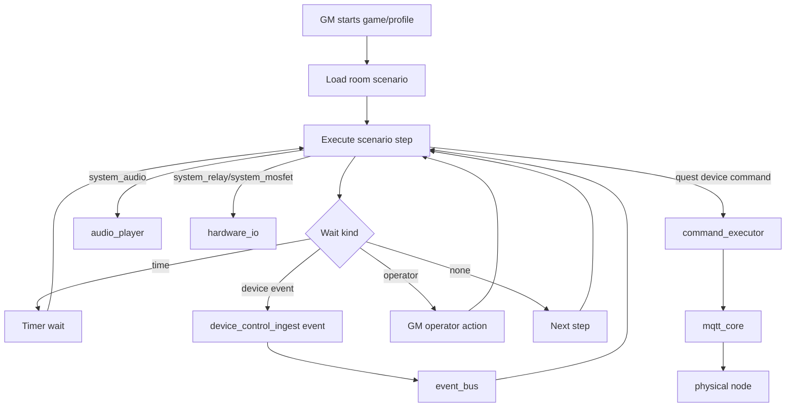

# SceneHub Hub Architecture Map

This document is a compact map of the SceneHub controller firmware. The durable
architecture text remains in `ARCHITECTURE.md`; this file is the quick visual
reference for ownership and data flow.

## Component Map

## Command Flow

## Scenario And Local System Flow

## Ownership Rules

- `web_ui` serializes requests and serves projections; it should not own domain
  execution.
- `scenehub_control` is the write-side application boundary.
- `scenehub_read_model` is read-side projection only.
- `gm_core` owns session/scenario runtime state and command planning.
- `command_executor` owns dispatch to MQTT, local hardware and system devices.
- `device_control_ingest` owns physical node telemetry parsing.
- `event_bus` transports events upward; handlers must stay light.
- `audio_player`, `hardware_io`, `mqtt_core` and storage modules own their own
  platform resources.

## Related Docs

- `ARCHITECTURE.md`
- `ARCHITECTURE_LAYER_RISK_MAP.md`
- `policies/API_HTTP_POLICY.md`
- `policies/LOCKING_POLICY.md`
- `policies/MEMORY_ALLOCATION_POLICY.md`
- `device_control_contract_v1.md`
- `../scenehub_node_v1/docs/ARCHITECTURE_MAP.md`
