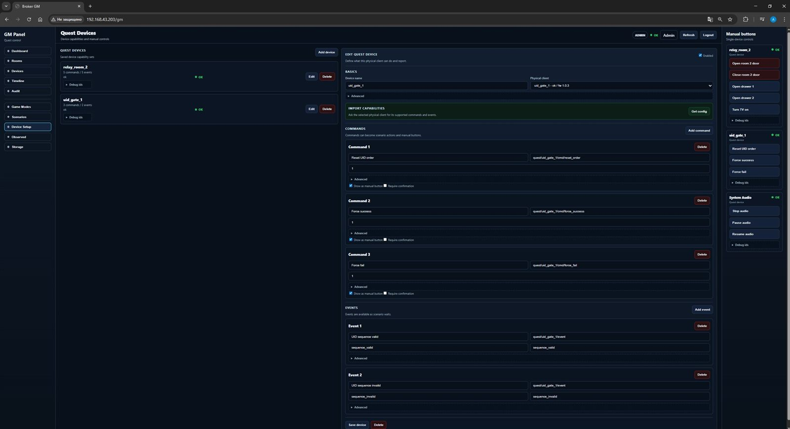

# Настройка Quest Devices

Quest Device - это сохраненное описание возможностей физического MQTT-клиента
или встроенного сервиса. Устройство сообщает состояние по единому control
contract, а Quest Device хранит команды и события, которые потом используются в
сценариях комнаты.

## Базовая идея

```text
физический клиент -> heartbeat/status/diag/result
Quest Device      -> commands/events
Room Scenario     -> использует commands/events
```

В устройстве не нужно собирать сценарий квеста. Устройство может иметь локальную
логику, но для панели оно должно показать:

- какие команды можно отправить;
- какие события оно может прислать;
- какой физический `client_id` с ним связан.

## Создание устройства



1. Откройте `/gm`.
2. Войдите как admin.
3. Перейдите в `Device Setup`.
4. Нажмите `Add device`.
5. Заполните:
   - `Device name` - понятное имя для оператора;
   - `Physical client ID` - MQTT client id из `Observed`;
   - `Enabled` - включено ли устройство.
6. Добавьте команды и события вручную или через discovery.
7. Нажмите `Save device`.

## Discovery через Get Config

Если физический клиент поддерживает `describe_interface`:

1. Выберите физический клиент.
2. Нажмите `Get config`.
3. Панель отправит команду `describe_interface`.
4. Клиент должен ответить в `result.data.quest_interface`.
5. Проверьте импортируемые команды/события.
6. Подтвердите импорт.
7. Сохраните Quest Device.

Discovery не выполняется автоматически в каждом heartbeat/status. Это сделано
специально, чтобы не гонять большие payload-ы постоянно.

## Команды

Минимальная команда:

```json
{
  "id": "open_door",
  "label": "Open door",
  "kind": "mqtt_publish",
  "topic": "quest/relay_room_2/cmd/open_door",
  "payload": "1",
  "button_enabled": true,
  "dangerous": false
}
```

Поля:

- `id` - стабильный id команды внутри устройства;
- `label` - имя в интерфейсе;
- `kind` - сейчас обычно `mqtt_publish`;
- `topic` - куда публиковать;
- `payload` - что публиковать;
- `button_enabled` - показывать ли команду справа как ручную кнопку;
- `dangerous` - выделить команду как опасную.

## События

Минимальное событие:

```json
{
  "id": "drawer_1_opened",
  "label": "Drawer 1 opened",
  "topic": "quest/relay_room_2/event/drawer_1",
  "payload": "opened",
  "event_type": "drawer_1_opened"
}
```

Поля:

- `id` - стабильный id события внутри устройства;
- `label` - имя в интерфейсе;
- `topic` - MQTT topic, который слушает брокер;
- `payload` - ожидаемый payload; пустое значение означает любой payload;
- `event_type` - тип события для runtime.

## Ручные кнопки

Команды с `button_enabled=true` появляются в правом сайдбаре GM panel.

Это нужно для одиночных действий:

- открыть замок;
- сбросить локальную головоломку;
- остановить звук;
- вручную включить экран.

Ручные кнопки не заменяют сценарий. Они нужны для оператора и сервисных действий.

## Health

Статус берется не из Quest Device, а из физического клиента:

- `heartbeat` - жив ли клиент;
- `status.health` - `ok`, `degraded`, `fault`;
- `diag` - диагностические ошибки;
- `result` - ответы на control-команды.

Если сохраненный Quest Device ссылается на `client_id`, но свежей телеметрии нет,
устройство считается offline, а комната получает критическую ошибку.

## Сохранение

Quest Devices сохраняются в:

```text
/sdcard/quest/quest_devices.json
```

Через UI доступны:

- save/load на SD;
- export/import JSON;
- CRUD устройства.

## Практический пример

Реле второй комнаты:

- имя: `Room 2 relay`;
- physical client: `relay_room_2`;
- команды:
  - `open_door`;
  - `close_door`;
  - `open_drawer_1`;
  - `open_drawer_2`;
  - `tv_on`;
- события:
  - `door_opened`;
  - `drawer_1_opened`;
  - `drawer_2_opened`.

После сохранения эти команды и события доступны в Scenario Builder.
