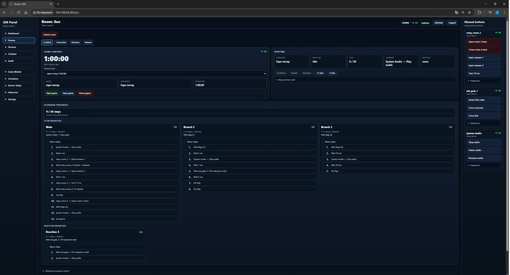
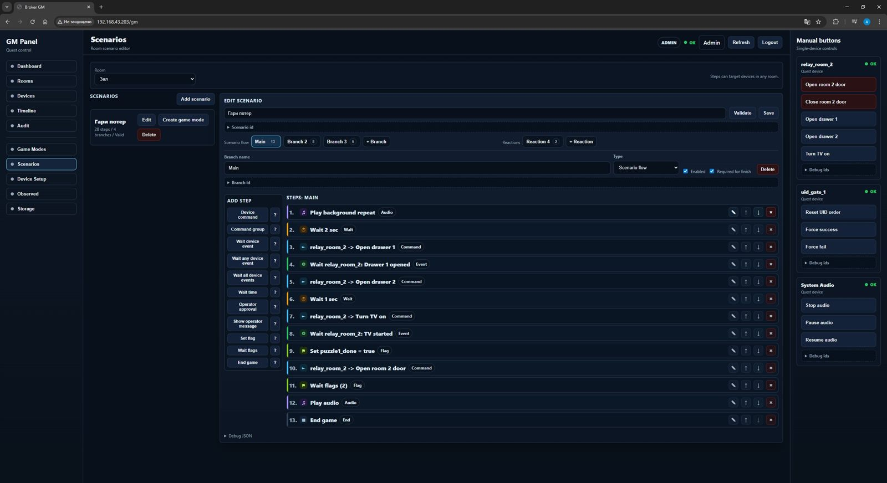
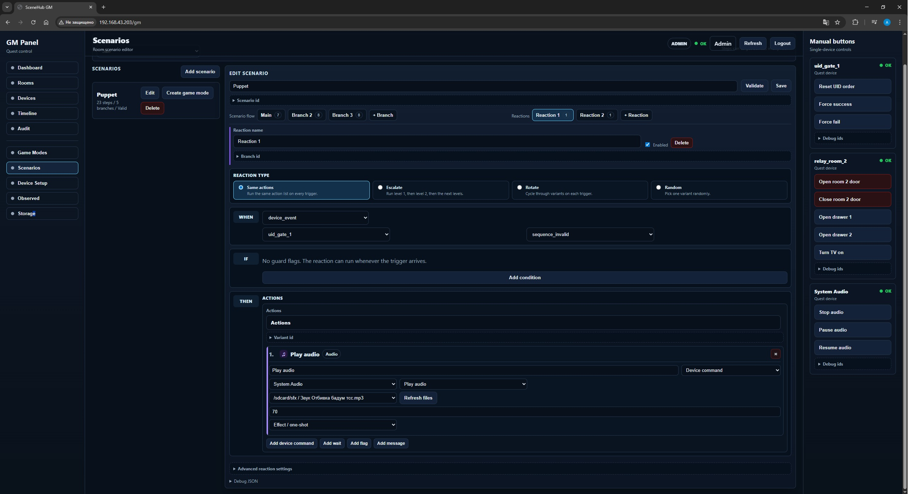

# Настройка Room Scenarios и Game Modes

Room Scenario - главный сценарный движок SceneHub. Сценарий использует команды
и события Quest Devices, ждёт время, события, оператора и флаги, а также может
завершить игру.

Game Mode выбирает сценарий и длительность игры.

## Общий порядок



1. Создать комнаты в `Rooms`.
2. Добавить Quest Devices в `Device Setup`.
3. Создать Room Scenario в `Scenarios`.
4. Создать Game Mode в `Game Modes`.
5. Выбрать Game Mode в комнате.
6. Запустить игру из Room Control.

## Сценарий



Сценарий принадлежит комнате-владельцу, но его шаги могут отправлять команды
устройствам из любой комнаты.

Основные сущности:

- `normal` branches - основной ход игры;
- `reactive` branches - реакции на события;
- `steps` - шаги внутри normal-ветки;
- `actions` - действия внутри reactive-ветки;
- flags - временные флаги одного запуска игры.

## Normal Branches

Normal-ветки описывают ход игры. Несколько normal-веток могут идти параллельно
и синхронизироваться через флаги.

Пример:

1. `Main` ждёт правильную UID-последовательность и ставит `room1_done=true`.
2. `Branch 2` ждёт `room1_done=true`, затем запускает следующий этап.
3. `Finish` ждёт несколько флагов и выполняет `END_GAME`.

Поле `Required for finish` означает, что ветка участвует в общем прогрессе
сценария. Reactive-ветки в завершение игры не входят.

## Reactive Branch v2



Reactive Branch - это реакция на событие, а не второй основной сценарий.

Структура реакции:

```text
Reaction type -> When -> If -> Then -> Advanced settings
```

Режимы:

- `Same actions` - каждый trigger запускает один и тот же список действий.
- `Escalate` - первый trigger запускает level 1, следующий level 2 и так далее.
- `Rotate` - варианты идут по кругу.
- `Random` - выбирается случайный вариант.

Для `Same actions` есть выбор:

- `Can repeat` - реакция может срабатывать много раз.
- `Run once` - реакция срабатывает один раз за запуск игры.

`Can repeat` сохраняет `max_fire_count=0`. `Run once` сохраняет
`max_fire_count=1`.

Trigger может быть:

- device event;
- flag changed;
- operator event;
- runtime event.

Guard flags позволяют запускать реакцию только при нужном состоянии флагов.

Actions внутри реакции сейчас поддерживают:

- device command;
- command group;
- wait time;
- set flag;
- show operator message.

Если action отправляет `result_required` команду, `accepted` не завершает action.
Только terminal `done` двигает реакцию дальше. `failed`, `rejected` и timeout
обрабатываются через result policy.

## Типы шагов

### DEVICE_COMMAND

Отправить одну команду устройству.

Примеры:

- `system_audio -> play`;
- `system_relay -> pulse`;
- `system_mosfet -> fade`;
- команда внешнего MQTT Quest Device.

### DEVICE_COMMAND_GROUP

Отправить несколько команд подряд.

Используйте для простых групп без ожидания результата от каждого устройства.
Команды с `result_required` внутри группы сейчас не поддерживаются.

### WAIT_DEVICE_EVENT

Ждать одно событие от одного устройства.

Примеры:

- UID gate прислал `sequence_valid`;
- relay controller прислал `drawer_1_opened`;
- input node прислал `button_pressed`.

### WAIT_ANY_DEVICE_EVENT

Ждать любое событие из списка.

### WAIT_ALL_DEVICE_EVENTS

Ждать все события из списка в любом порядке.

### WAIT_TIME

Пауза в секундах.

### OPERATOR_APPROVAL

Остановиться и ждать подтверждения оператора.

### SHOW_OPERATOR_MESSAGE

Показать оператору сообщение и продолжить.

### SET_FLAG

Записать временный флаг текущего запуска игры.

Примеры:

- `room1_done=true`;
- `secret_path_unlocked=true`;
- `actor_ready=true`.

Флаги сбрасываются при новом старте сценария.

### WAIT_FLAGS

Ждать нужные значения флагов.

### END_GAME

Завершить игру: остановить таймер и перевести сессию в finished.

`END_GAME` не останавливает аудио автоматически и не гасит hardware outputs.
Если нужен стоп музыки, добавьте перед `END_GAME` отдельный шаг:

```text
DEVICE_COMMAND -> System Audio -> Stop audio
```

Если нужно погасить реле или MOSFET в финале, добавьте явные команды:

```text
DEVICE_COMMAND -> System Relay -> Relay set/off
DEVICE_COMMAND -> System MOSFET -> MOSFET all off
```

`Stop game` и `Reset game` делают safe-off для локальных system relay/MOSFET/GPIO.

## Built-in System Devices

SceneHub добавляет встроенные устройства:

- `system_audio`
- `system_relay`
- `system_mosfet`

`system_relay`:

- `set`
- `pulse`
- `toggle` только manual/debug, не для сценариев

`system_mosfet`:

- `set`
- `fade`
- `pulse`
- `all_off`

Для постоянного состояния используйте `set`. Для короткого триггера используйте
`pulse`. Если канал уже включён и выполнить `pulse`, после окончания pulse он
будет выключен или восстановлен по логике конкретного канала, поэтому не
используйте `pulse` как замену `set on`.

## Практический пример

Сценарий на несколько комнат:

1. `Main`
   - play background;
   - wait `uid_gate.sequence_valid`;
   - set flag `room1_done=true`.
2. `Branch 2`
   - wait flag `room1_done=true`;
   - play background for room 2;
   - wait `drawer_1_opened`;
   - set flag `room2_done=true`.
3. `Branch 3`
   - wait flag `room2_done=true`;
   - wait `tv_started`;
   - set flag `room3_done=true`.
4. `Finish`
   - wait flags `room2_done=true`, `room3_done=true`;
   - stop audio;
   - optional relay/MOSFET/GPIO cleanup;
   - `END_GAME`.

Reactive example:

- trigger: `uid_gate.sequence_invalid`;
- mode: `Same actions`;
- trigger behavior: `Can repeat`;
- actions:
  - play short SFX;
  - pulse local relay for 1 second.

This reaction can run repeatedly during the same game, while the main flow keeps
waiting for the correct UID sequence.
