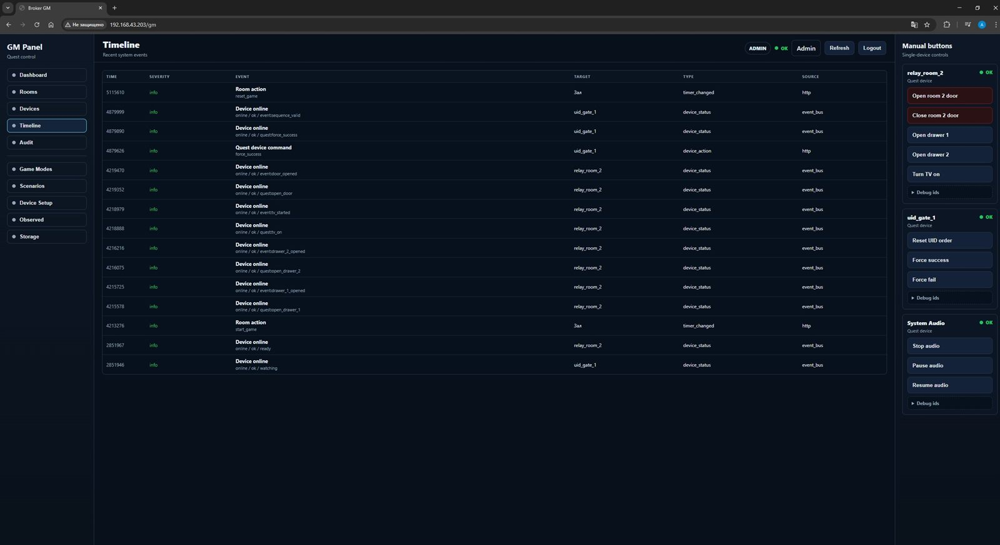

# Testing

This project is tested at two levels:

- host-side or ESP-IDF test applications under `tests/`
- on-device smoke checks through the Quest Orchestrator GM Panel and MQTT clients

## Current Test Apps

### `tests/quest_backend`

This is the main integration test app for the current quest backend:

- Quest Device import/export and validation
- Room Scenario JSON, validation and runtime
- Game Mode validation and storage
- GM session game start/stop/reset
- scenario wait steps, command steps, flags and branches

Run from:

```powershell
cd D:\Projects\SceneHub\tests\quest_backend
idf.py build
idf.py flash monitor
```

### `tests/mqtt_core`

MQTT core coverage for publish/subscribe behavior and payload handling.

Run from:

```powershell
cd D:\Projects\SceneHub\tests\mqtt_core
idf.py build
idf.py flash monitor
```

## GM Panel Checks



After UI changes:

```powershell
python components\web_ui\assets\build_gm_panel.py components\web_ui\assets\gm_panel.js components\web_ui\assets\gm_panel\gm_panel_00_base.js components\web_ui\assets\gm_panel\gm_panel_00_ui.js components\web_ui\assets\gm_panel\gm_panel_00_api.js components\web_ui\assets\gm_panel\gm_panel_00_form.js components\web_ui\assets\gm_panel\gm_panel_00_actions.js components\web_ui\assets\gm_panel\gm_panel_01_state_helpers.js components\web_ui\assets\gm_panel\gm_panel_01a_scenario_runtime.js components\web_ui\assets\gm_panel\gm_panel_01b_editor_dirty.js components\web_ui\assets\gm_panel\gm_panel_01c_quest_device_status.js components\web_ui\assets\gm_panel\gm_panel_01d_generic_helpers.js components\web_ui\assets\gm_panel\gm_panel_02_room_rendering.js components\web_ui\assets\gm_panel\gm_panel_03_main_views.js components\web_ui\assets\gm_panel\gm_panel_04_hardware_io_view.js components\web_ui\assets\gm_panel\gm_panel_04_profiles_view.js components\web_ui\assets\gm_panel\gm_panel_05a_scenario_model.js components\web_ui\assets\gm_panel\gm_panel_05b_scenario_payloads.js components\web_ui\assets\gm_panel\gm_panel_05c_reactive_v2.js components\web_ui\assets\gm_panel\gm_panel_05d_scenario_branches.js components\web_ui\assets\gm_panel\gm_panel_05e_scenario_steps.js components\web_ui\assets\gm_panel\gm_panel_05f_scenario_validation.js components\web_ui\assets\gm_panel\gm_panel_05_scenario_builder.js components\web_ui\assets\gm_panel\gm_panel_06_storage_and_render.js components\web_ui\assets\gm_panel\gm_panel_07_loaders_and_runtime_actions.js components\web_ui\assets\gm_panel\gm_panel_08_editor_actions.js components\web_ui\assets\gm_panel\gm_panel_09_scenario_change_events.js components\web_ui\assets\gm_panel\gm_panel_09_editor_events.js components\web_ui\assets\gm_panel\gm_panel_09_events_boot.js
node --check components\web_ui\assets\gm_panel.js
git diff --check
```

On hardware, verify:

- `/gm` opens without httpd stack overflow
- admin login shows Device Setup, Scenarios, Game Modes and Storage
- operator view can start/stop/reset a game and see manual buttons
- Device Setup can request device interface config and save commands/events
- Hardware IO screen can refresh local relay/MOSFET status and run safe test commands
- Scenarios persist after reboot
- Game Modes persist after reboot
- offline registered devices create room/system faults

## Scenario Runtime Smoke

Recommended smoke scenario:

1. Create or import two Quest Devices with manual commands/events.
2. Create one room.
3. Create one scenario with:
   - `DEVICE_COMMAND`
   - `WAIT_TIME`
   - `WAIT_DEVICE_EVENT`
   - `DEVICE_COMMAND_GROUP`
   - `WAIT_ALL_DEVICE_EVENTS`
   - `OPERATOR_APPROVAL`
   - `END_GAME`
4. Create a Game Mode bound to that scenario.
5. Start the game from Room Control.
6. Confirm the scenario advances through command, time, event and operator waits.
7. Stop/reset the game and confirm audio is stopped on stop.
8. While background audio is playing, press Stop game and confirm the output
   goes silent immediately without holding the last sound sample.
9. If local hardware IO pins are configured, confirm Stop game and Reset game
   force built-in relay/MOSFET/GPIO outputs off.

## Storage Smoke

Verify these files survive reboot:

- `/sdcard/quest/rooms.json`
- `/sdcard/quest/quest_devices.json`
- `/sdcard/quest/room_scenarios.json`
- `/sdcard/quest/game_profiles.json`

## Test Policy

- Add focused tests for every new scenario step type.
- Add validation tests before UI depends on new fields.
- Keep UI bundle syntax checks mandatory for every GM panel change.
- Do not add new tests for removed compatibility paths.
