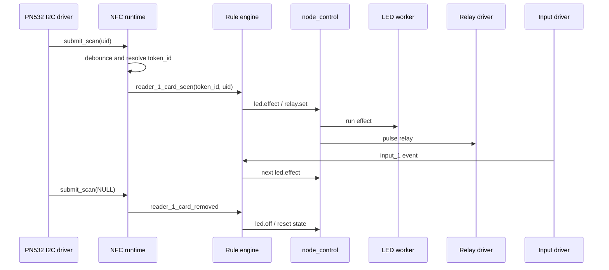
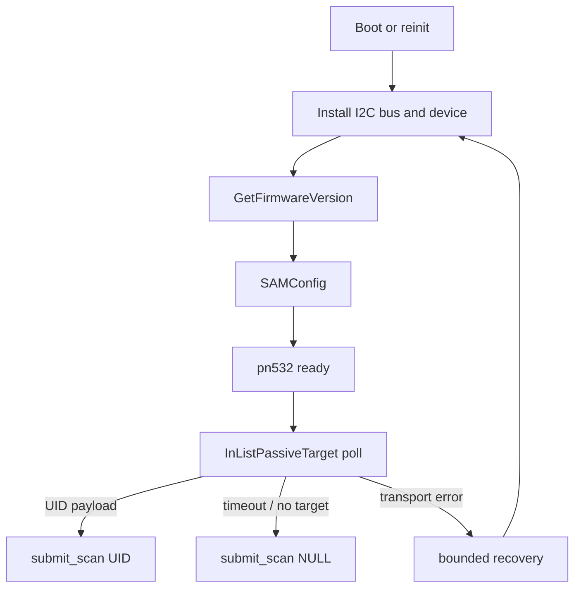

# SceneHub Node Architecture Map

This document is a compact map of the current node firmware boundaries and
runtime links. It is meant for implementation and debugging, not as a marketing
diagram.

## Component Map

```mermaid
flowchart LR
    Controller[SceneHub Controller]
    MQTT[(MQTT Broker)]
    NodeMQTT[node_mqtt_transport]
    Control[node_control]
    RuleEngine[node_rule_engine]
    NFC[node_driver_nfc_reader_runtime]
    PN532[node_driver_pn532_i2c]
    HW[node_hardware_io]
    LED[node_hw_led]
    Relay[node_hw_relay]
    Input[node_hw_input]
    Provisioning[node_provisioning]
    Config[node_config]
    Snapshot[node_runtime_snapshot]

    Controller <-->|device contract| MQTT
    MQTT <-->|cp/v1/dev/{node_id}/...| NodeMQTT
    NodeMQTT -->|remote commands| Control
    NodeMQTT -->|status/diag/result/event| MQTT

    Provisioning -->|load/save| Config
    Config -->|boot config| RuleEngine
    Config -->|driver config| NFC
    Config -->|pin config| HW

    RuleEngine -->|local commands| Control
    Control -->|relay.set / led.*| HW
    HW --> LED
    HW --> Relay
    HW --> Input

    PN532 -->|scan uid / absent| NFC
    NFC -->|reader_1_card_seen / removed| RuleEngine
    Input -->|input events| RuleEngine

    NFC --> Snapshot
    HW --> Snapshot
    RuleEngine --> Snapshot
    Snapshot --> Provisioning
```

## Runtime Ownership

- `node_mqtt_transport` owns MQTT connection, subscribe and publish transport.
- `node_control` is the command facade. It validates command args and calls
  hardware/runtime owners.
- `node_rule_engine` owns standalone bundle execution and local event handling.
- `node_driver_nfc_reader_runtime` owns debounced NFC presence state and known
  card token resolution.
- `node_driver_pn532_i2c` owns PN532 I2C framing, init, polling and recovery.
- `node_hardware_io` owns physical relay, MOSFET, input and LED access.
- `node_provisioning` owns local setup UI and runtime configuration writes.

## NFC Event Flow



## PN532 I2C Frame Flow



Normal no-card polling is not a warning. The driver reports absence to the NFC
runtime so presence-based rules can turn effects off when the card is removed.

## Log Policy

Default `INFO` logs should show lifecycle and real state changes that matter in
field diagnostics:

- Wi-Fi got IP;
- MQTT connected/subscribed;
- PN532 ready/recovered/offline;
- provisioning start/stop;
- warnings and errors.

High-frequency normal events are `DEBUG`:

- `reader event seen/removed`;
- successful `led.*` commands;
- LED effect start/done/cancel;
- stack allocation details.

This keeps serial monitor readable during NFC presence tests.

## Boundaries To Keep

- PN532 driver must not call rule actions directly.
- Rule engine must not talk to I2C or GPIO drivers directly.
- MQTT transport must not know hardware implementation details.
- Provisioning may write config, but normal runtime must continue without the UI.
- Driver queue backpressure must not be treated as physical hardware failure.
